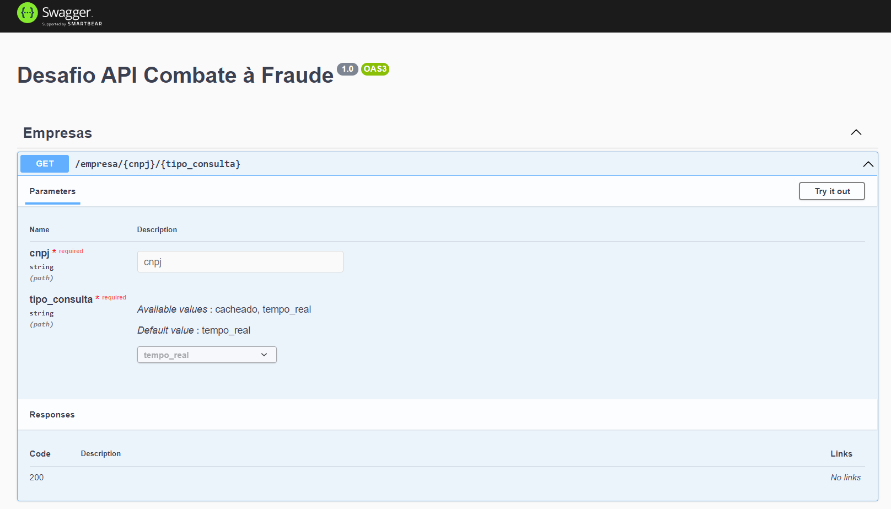
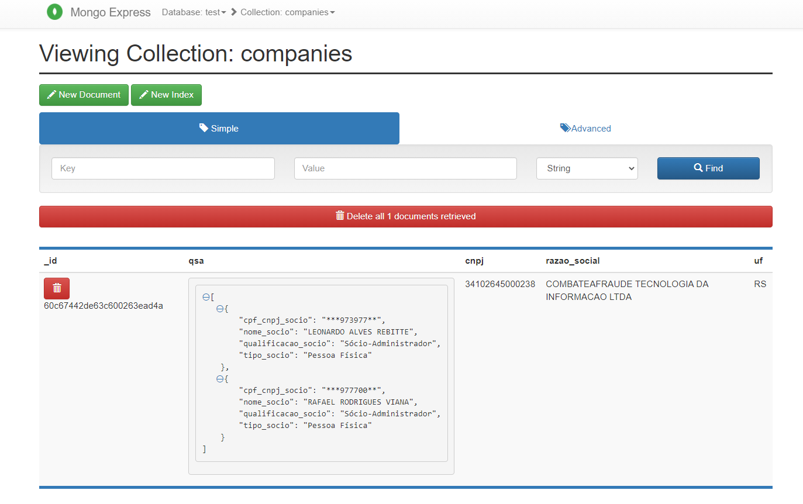

# Desafio API Combate à Fraude


## Projeto
Este repositório é referente ao desafio proposto pela empresa Combate à Fraude.

Foi criada uma API utilizando o framework NestJS com TypeScript e usando mongoDB para cache como solicitado. Para documentação foi utilizado o Swagger.

Foi criado um arquivo docker-compose.yml para subir o banco e aplicação para testes locais. 

## Instruções e Configuração

- Clonar repositório:
```
git clone https://github.com/bonetou/desafio-api-combate-a-fraude
```

- Criar uma conta no site Brasil.io e gerar uma Chave de API

- Editar o arquivo .env disponível na raíz deste repositório mudando as seguintes variáveis:
``` 
AUTH_TOKEN=SUA_API_TOKEN_AQUI
DB_USER=USUARIO_BANCO_DE_DADOS
DB_PASSWORD=SENHA_BANCO_DE_DADOS
```
Exemplo:
```
AUTH_TOKEN=Token 123456789
DB_USER=test
DB_PASSWORD=test
```

- Rodar o seguinte comando docker-compose:
```
docker-compose --env-file .env up
```

## Uso e Teste

- Para testar a API, acessar: http://localhost:3000/swagger
  - Inserir CNPJ.
  - Escolher tipo de consulta: tempo_real ou cacheado.
- Para testar e checar as mudanças no banco de dados local, acessar: http://localhost:8081

Exemplo Swagger:



Exemplo Banco de Dados:


